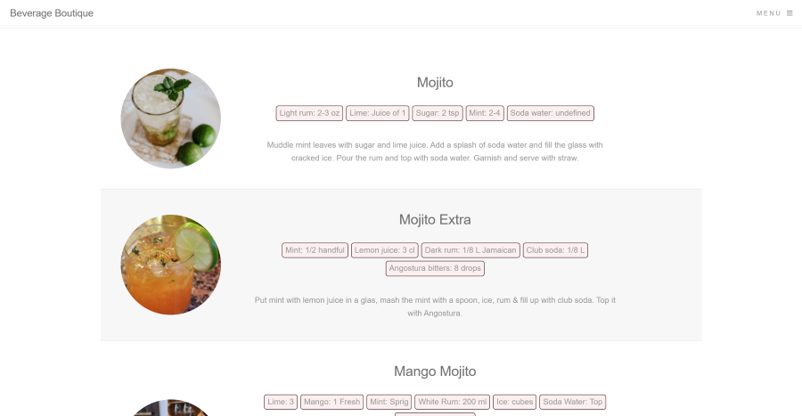
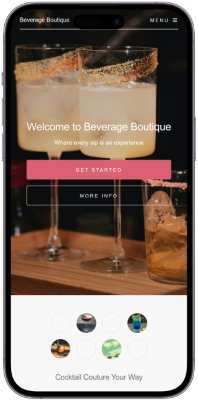
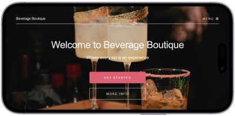

# Beverage Boutique

A beverage recipe website for both alcoholic and nonalcoholic drinks. The site allows you to search using drink names or keywords to find the ingredients, measurements and instructions for crafting your next drink.

## Table of contents

- [Overview](#overview)
  - [Screenshot](#screenshot)
  - [Links](#links)
- [My process](#my-process)
  - [Built with](#built-with)
  - [What I learned](#what-i-learned)
  - [Continued development](#continued-development)
  - [Useful resources](#useful-resources)
- [Author](#author)

## Overview

### Screenshot

### Links

- Repository URL: [Here](https://github.com/codewithjazzy/Beverage-Boutique)
- Live Site URL: [Here](https://beverageboutique.netlify.app/)

## My process

### Built with

  
   
  
  

### What I learned

The motivation behind this project was to practice what I had learned about Fetch API, public APIs, JSON, Promises, and network requests.  
I learned how to read API documentation, use keys and query parameters, and piece it all together in my Javascript file to make a dynamic website. I also got more practice with array methods so that the parsed data did what I needed it to do.

### Continued development

This is always a WIP and with time, I'd like to work on a few more ideas:

- Additional search parameters
- Filtering search results
- More beverages per line for searches with 20+ results
- Font & Styling edits

### Useful resources

- [TheCocktailDB API](https://www.thecocktaildb.com/api.php) - An open, crowd-sourced database of drinks and cocktails from around the world with a free cocktail API
- [Postman API Platform](https://www.postman.com/) - Simplified API usage
- [MDN Web Docs](https://developer.mozilla.org/en-US/) - Always a tab away for brushing up on methods or troubleshooting broken code

## Author
- LinkedIn - [@CodeWithJazzy](www.linkedin.com/in/codewithjazzy)
- Twitter - [@CodeWithJazzy](https://twitter.com/CodeWithJazzy)